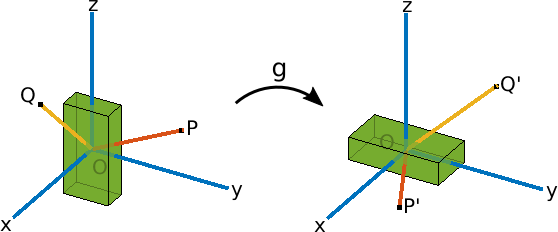

# QUIZ 2.1 

---

  

**1.** Which of the following matrices are rotation matrices?

**Ans :** 

- [x] $$
  \left[\begin{array}{cc} 
  \cos(\theta) & -\sin(\theta)\\
  \sin(\theta) & \cos(\theta)
  \end{array}\right]
  $$

- [x] $$
  \left[\begin{array}{cc} 
  ^\sqrt{2}/_2 & 0 & ^\sqrt{2}/_2\\
  0 & 1 & 0 \\
  -^\sqrt{2}/_2 & 0 & ^\sqrt{2}/_2
  \end{array}\right]
  $$

- [x] $$
  \left[\begin{array}{cc} 
  0.2120 & 0.7743 & 0.5963\\
  0.2120 & -0.6321 & 0.7454 \\
  0.9540 & -0.0316 & -0.2981
  \end{array}\right]
  $$

- [ ] $$
  \left[\begin{array}{cc} 
  0.3835 & 0.5730 & 0.9287\\
  0.5710 & -0.5919 & -0.4119 \\
  -1.3954 & 0.0217 & 1.1105
  \end{array}\right]
  $$

  

**2.** What is the ZYZ euler angle representation,
$$
(\varphi, \theta, \phi), for the following rotation matrix?
$$
, for the following rotation matrix?
$$
\left[\begin{array}{cc} 
0.6927 & -0.7146 & 0.0978\\
0.7165 & 0.6973 & 0.0198 \\
-0.0824 & 0.0564 & 0.995
\end{array}\right]
$$
**Ans : **

- [x] (0.2, 0.1, 0.6)
- [ ] (0.1, 0.1, 0.2)
- [ ] (0.7, 0.4, 0.2)
- [ ] (0.9, 0.1, 0.1)

  

**3.** At a given time t, the rotation matrix R has the value: 
$$
R = \left[\begin{array}{cc} 
0.675 & -0.1724 & 0.7174\\
0.2474 & 0.9689 & 0 \\
-0.6951 & 0.1775 & 0.6967
\end{array}\right]
$$
The angular velocity at the same time,
$$
\hat{\omega}^{b} = \left[\begin{array}{cc} 
0 & -1 & 0.9689\\
1 & 0 & -0.2474 \\
-0.9689 & 0.2474 & 0
\end{array}\right]
$$
What is
$$
\hat{\omega}^{s}
$$

**Ans : ** 
$$
\left[\begin{array}{cc} 
0 & -0.6967 & 1\\
0.6967 & 0 & -0.7174 \\
-1 & 0.7174 & 0
\end{array}\right]
$$
  

**4.** Given the following rotation matrix, what is the corresponding axis-angle representation assuming the angle is restricted to [0,π] ? 
$$
\left[\begin{array}{cc} 
0.2919& 0.643 & -0.7081\\
-0.643 & -0.4161 & -0.643 \\
-0.7081 & 0.643 & 0.2919
\end{array}\right]
$$
**Ans :** 
$$
u = [\begin{array}{cc}
^\sqrt{2}/_2 & 0 & -^\sqrt{2}/_2
\end{array}]
; \theta = 2\\
Sol : \\
Let\ R = \left[\begin{array}{}
a & b & c \\
d & e & f \\
g & h & i
\end{array}\right] \\
Then, \ u = \left[\begin{array}{}
h - f \\
c - g \\
d - b
\end{array}\right] \ ; \  \theta = arccos(\frac{Tr(R) - 1}{2})
$$
  

**5.**  Given the following rotation matrix, what is the corresponding axis-angle representation assuming the angle is restricted to [0,π] ?
$$
\left[\begin{array}{cc} 
^{1}/_3 & ^{2}/_3 & -^{2}/_3\\
^{2}/_3 & -^{1}/_3 & -^{2}/_3 \\
-^{2}/_3 & -^{2}/_3 & -^{1}/_3
\end{array}\right]
$$
**Ans : ** There is no unique solution

  

**6.** Recall the transformation from the in-video exercises:

 

Assuming **p** and **q** represent the vectors from the origin to the points P and Q respectively, which of the following are correct expressions for the cross-product of the rotated vectors **p′** x **q′** ?

**Ans : **

- [ ] **p** x **q**
- [x] g*(**p**) x g\*(**q**)
- [x] g*(**p** x **q**) 

