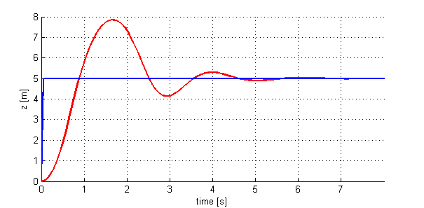
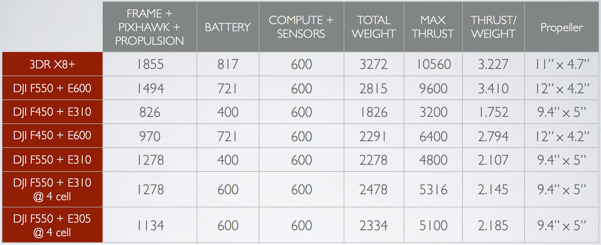

# QUIZ 1.2

---

  

**1.** You observe the response of a system shown in the figure below

 

What should you do to decrease the oscillations in the response?

**Ans:**

- [ ] Increase the integral gain (*Ki*)
- [x] Increase the derivative gain (*Kv*)
- [ ] Increase the proportional gain (*Kp*)
- [x] Decrease the proportional gain (*Kp*)

  

**2.** Given that the derivative gain *Kv* = 5, find the proportional gain *Kp* (up to two decimal places) such that the rise time is less than 1s and overshoot less than 5%.

**Ans:** 12 (Approx.)

  

**3.** Assuming we are using the F550 + E310 + 4 cell battery with a 200g on-board computer and a laser (270g), what is the thrust to weight ratio of the platform? (We use the term "weight" and "thrust" loosely. Except for Thrust/Weight and
Propeller, all units are in grams)

 

**Ans:** 2.264

  

**4.** Why don’t all the rotors of a quad-rotor spin in the same direction? 

**Ans:** 

- [ ] Spinning all rotors in the same direction uses more battery power.  
- [x] Spinning all rotors in the same direction will cause the robot to constantly rotate.
- [ ] Spinning all rotors in the same direction does not allow the quad-rotor to fly upside down.  

  

**5.** Given that a quad-rotor consumes 200 W to carry a mass of 1kg, which component contributes more to the quad-rotor's total power consumption?

A 100g computer that consumes 30W for operation or a 200g laser which consumes 20W for operation?

**Ans:**

- [ ] The computer.
- [x] The laser.
- [ ] Both contribute the same to the power consumption.  

